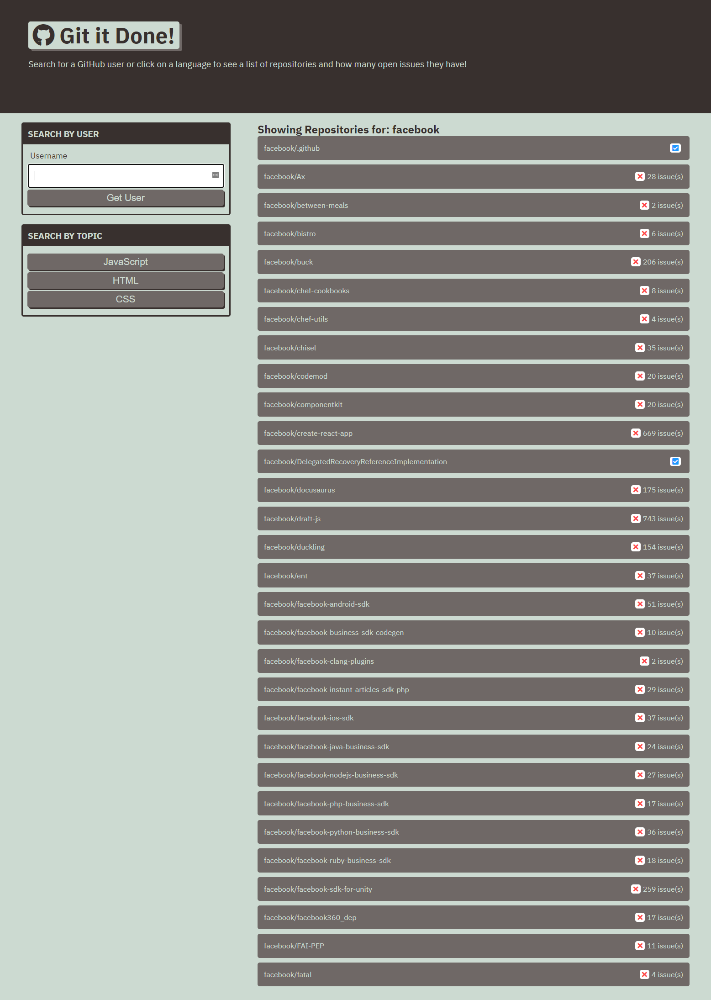

# Git it Done

## Page Description
This page provides a GUI for searching GitHub repositories either by name or by featured repositories for one of three languages: JavaScript, HTML, and CSS.  Searching populates a list of repositories on the index.html page.  Clicking on one of the repositories will direct the user to a second html page where open issues for that repository are listed. Clicking on an issue will take the user to the issue on GitHub, where they can chose to contribute to the solution if they so desire.  Error handling for invalid repo names and network errors is implemented to inform the user of the problem and redirect back to the home page to try another search.

## Tools Used
JavaScript
HTML
CSS

## Page Link
This page is hosted at https://kpehl.github.io/git-it-done/ 

## Screenshot
